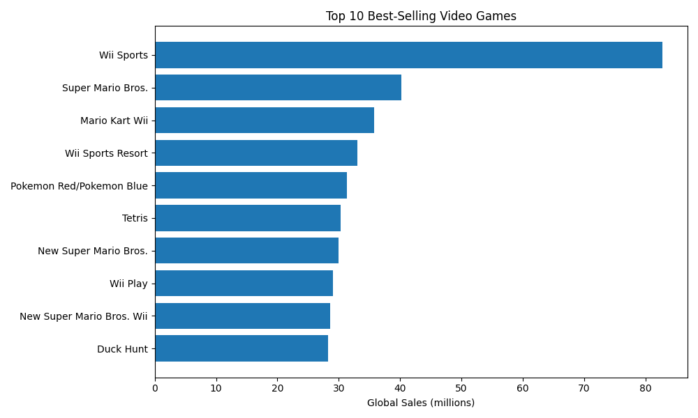
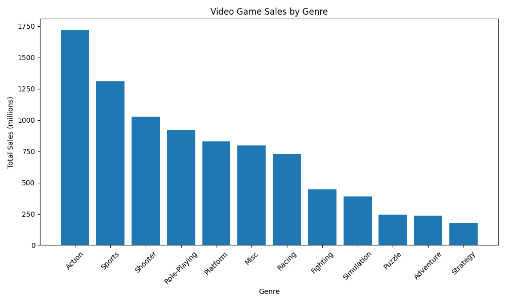
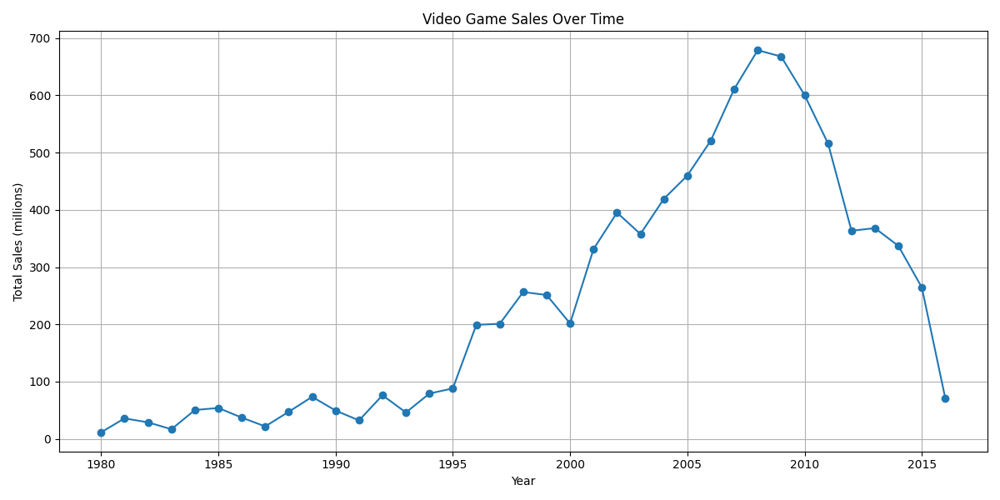
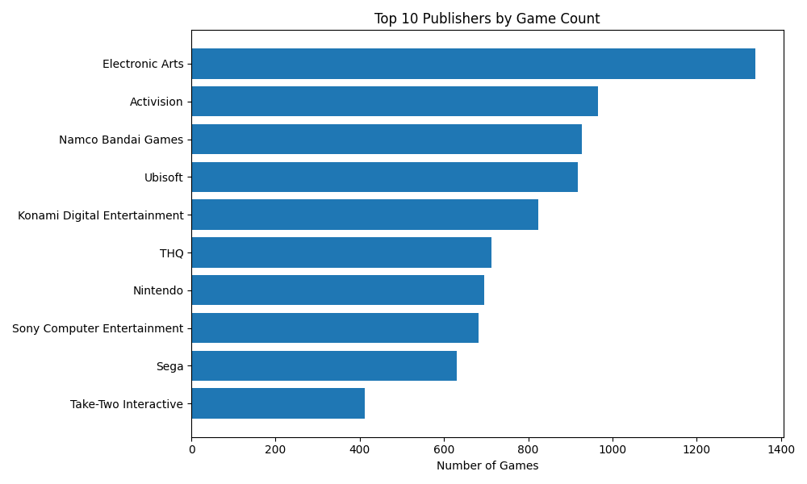
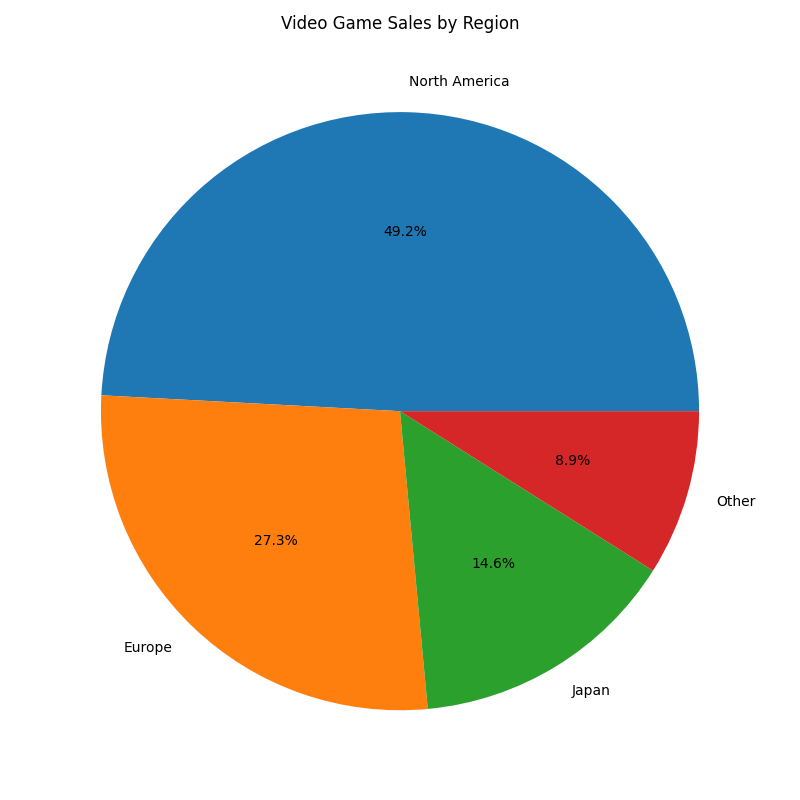

# Video Game Sales Data Analysis

## Dataset
This project analyzes video game sales data from 1980-2016, containing information about 16,000+ games across various platforms, genres, and regions. The dataset was obtained from Kaggle's Video Game Sales dataset.

## Questions Explored
1. What are the top 10 best-selling games globally?
2. Which genre is most popular by total sales?
3. How have game sales changed over time?
4. Which publishers have released the most games?
5. Which region buys the most games?

## Key Findings
- **Best-selling game**: Wii Sports dominates with 82.74 million copies sold globally
- **Most popular genre**: Action games lead in total sales, followed by Sports games
- **Sales peak**: The video game industry saw peak sales around 2008-2009
- **Top publisher**: Electronic Arts has released the most games in this dataset
- **Regional preferences**: North America is the largest market, accounting for approximately 49% of global sales

## Visualizations

### Top 10 Best-Selling Games

### Sales by Genre

### Sales Over Time

### Top 10 Publishers

### Sales by Region

## Tools Used
- Python 3.14
- pandas - data manipulation and analysis
- matplotlib - data visualization

## How to Run
1. Clone this repository
2. Install required packages: `python -m pip install pandas matplotlib`
3. Ensure `vgsales.csv` is in the `data/` folder
4. Run: `python analysis.py`
5. View the generat